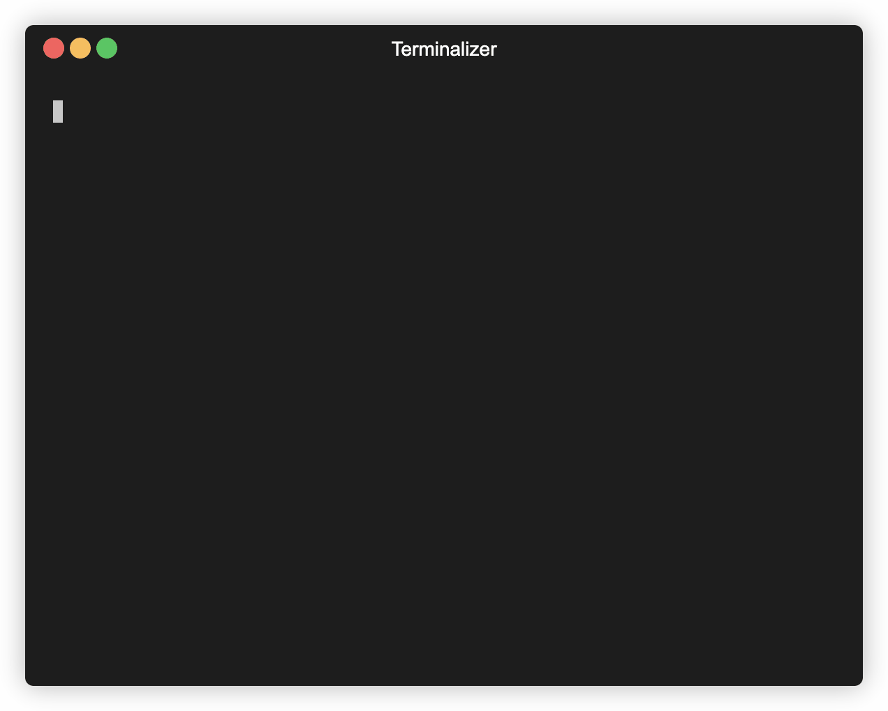

# 🌿gbr

Switch git branch interactively using arrow keys

## Demo



## How to use

### Requirements

You need to have `node` installed. This tutorial uses `yarn` as a package manager, you can also use `npm` instead.

### Install

```bash
cd ~
git clone git@github.com:Kadrian/gbr.git
cd gbr
yarn
yarn build
```

That creates a `/dist/main.js` file.

Now create an alias in your `~/.bashrc` / `~/.zshrc` file or similar, add this line

```bash
alias gbr="node ~/gbr/dist/main.js"
```

Source your file again, for example

```bash
source ~/.zshrc
```

### Run

Now in any git repository, run

```bash
gbr
```
