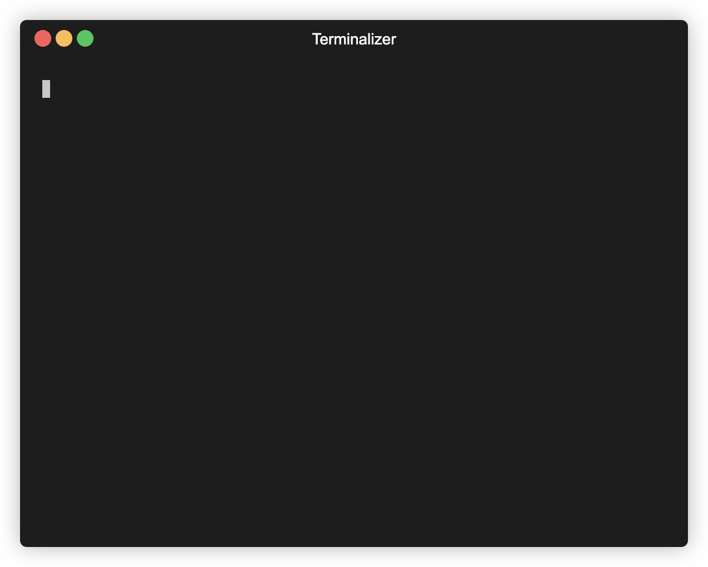

# 🌿gbr

Switch git branch interactively using arrow keys.



## Install

```bash
# macOS
brew install kadrian/tap/gbr

# Arch Linux
yay -S gbr-bin

# Go
go install github.com/Kadrian/gbr@latest
```

Pre-built binaries also available on the [releases page](https://github.com/Kadrian/gbr/releases).

On macOS, if you see a "not verified" warning on first run:
```bash
xattr -d com.apple.quarantine $(which gbr)
```

## Usage

```bash
gbr
```
